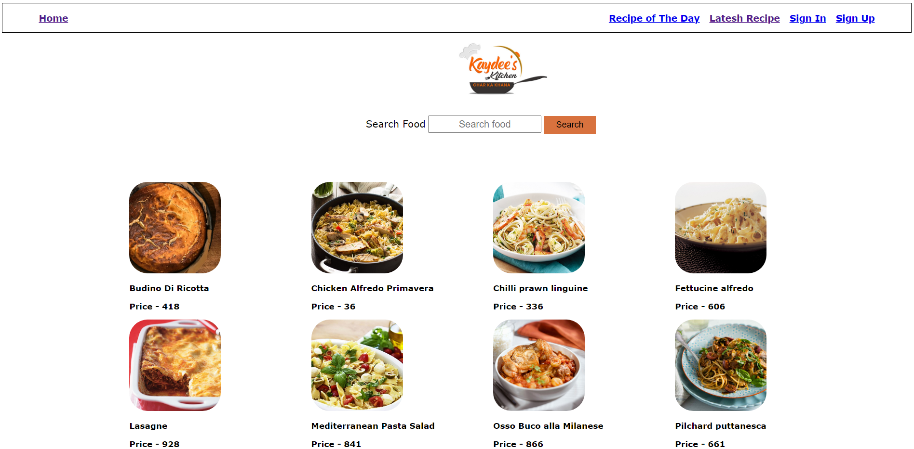
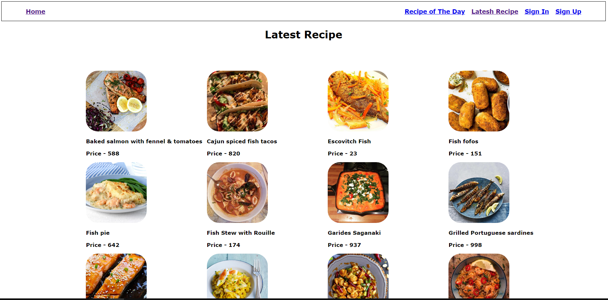

<h1>Food Searching Website</h1>
<h3>It is food search website that allows you to search any kind of food and beverages, This websites takes help of API for generating food data. </h3>
 
<h2>Language and Tools</h2>

 
<h2>Screenshots</h2>
<h3>Main Page</h3>

 
 
<h3>Latest Reciepe</h3>

 
 
<h3Reciepe of The Day</h3>

